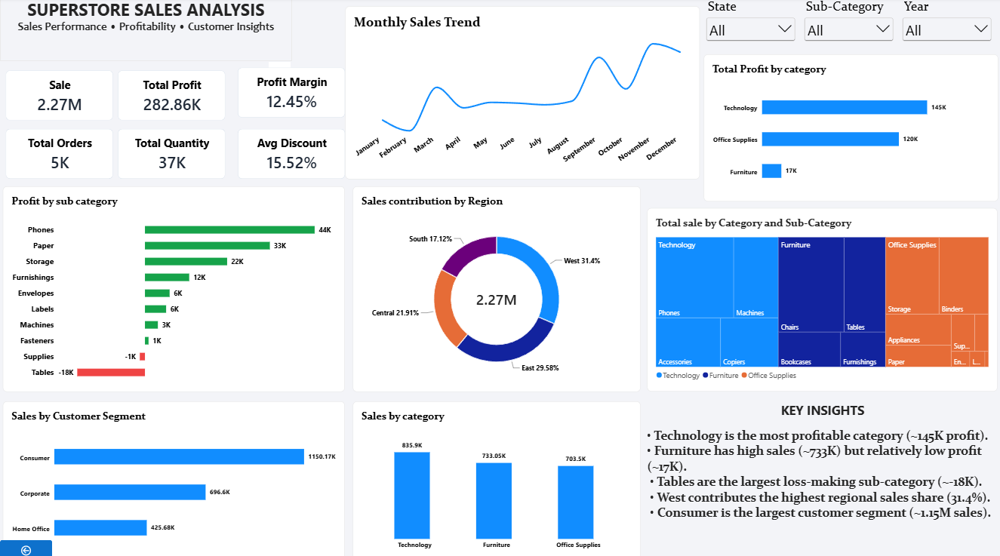

# 📊 Superstore Sales Analysis

## 📌 Project Overview

This project is an end-to-end data analysis project based on Superstore sales data.

The objective is to analyze sales, profit, customers, products, regions, categories, discounts, and overall business performance using Python and Power BI.

### Project Workflow

**Data Understanding → Data Quality Check → Data Preparation → Exploratory Data Analysis → Business Analysis → Power BI Dashboard → Insights & Recommendations**

---

## 🎯 Business Objectives

- Analyze overall sales and profit performance
- Identify the most profitable and loss-making categories
- Analyze sales performance across regions
- Understand customer segment performance
- Identify high and low-performing sub-categories
- Analyze sales trends over time
- Study the relationship between discount and profitability
- Generate actionable business insights

---

## 🛠️ Tools & Technologies

- **Python**
- **Pandas**
- **NumPy**
- **Matplotlib**
- **Seaborn**
- **Jupyter Notebook**
- **Power BI**
- **DAX**
- **GitHub**

---

## 📂 Dataset

The project uses Superstore sales transaction data containing information about:

- Orders
- Customers
- Products
- Categories
- Sub-Categories
- Regions
- Sales
- Quantity
- Discount
- Profit

---

## 🔍 Data Understanding & Quality Check

The dataset was first explored using Pandas to understand its structure, columns, data types, and statistical characteristics.

The following data quality checks were performed:

- Dataset shape
- Column names
- Data types
- Missing values
- Duplicate records
- Unique values
- Statistical summary

### Data Quality Result

- **Rows:** 9,694
- **Columns:** 21
- **Missing Values:** 0
- **Duplicate Rows:** 0

Since the dataset contained no missing values or duplicate records, no major row-level cleaning was required.

Date fields were prepared for time-based analysis.

---

## 🐍 Python Analysis & EDA

Exploratory Data Analysis was performed using Pandas, Matplotlib, and Seaborn.

### Key Analysis

- Sales by Category
- Profit by Category
- Profit by Sub-Category
- Sales by Region
- Sales by Customer Segment
- Monthly Sales Trend
- Discount vs Profit
- Top Products by Sales
- Loss-Making Sub-Categories

The complete Python analysis is available in the Jupyter Notebook included in this repository.

---

## 📊 Power BI Dashboard

An interactive Power BI dashboard was created to provide a business-focused view of sales and profitability.

### Dashboard Features

- KPI Cards
- Sales & Profit Analysis
- Category Performance
- Sub-Category Profitability
- Regional Sales Analysis
- Customer Segment Analysis
- Monthly Sales Trend
- Discount Analysis
- Profit/Loss Analysis
- Interactive Slicers

---

## 💡 Key Insights

- Technology is the strongest category from a profitability perspective.
- Furniture generates strong sales but comparatively lower profit.
- Tables are a major loss-making sub-category.
- The West region contributes the highest share of sales.
- Consumer is the largest customer segment by sales.
- Sales performance varies across different months.
- Higher discount levels are associated with lower profitability in some transactions.

---

## 🎯 Business Recommendations

1. Investigate the low profitability of Furniture despite its strong sales.

2. Review pricing and discount strategies for loss-making products, especially Tables.

3. Focus on high-performing Technology products to strengthen overall profitability.

4. Develop strategies to retain and grow the Consumer customer segment.

5. Monitor discount levels carefully to protect profit margins.

6. Analyze regional performance to identify opportunities for growth.

---

## 🖼️ Dashboard Preview



---

## 📁 Project Structure

```text
Superstore-Sales-Analysis/
│
├── README.md
│
├── data/
│   └── processed/
│       └── sample_superstore_cleaned.csv
│
├── Superstore_Sales_Analysis.ipynb
│
├── Superstore_Sales_Analysis.pbix
│
└── Superstore_Dashboard.png
